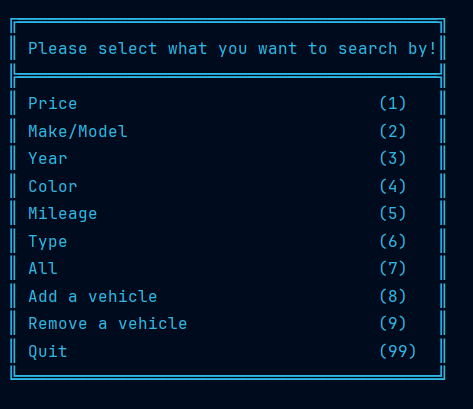
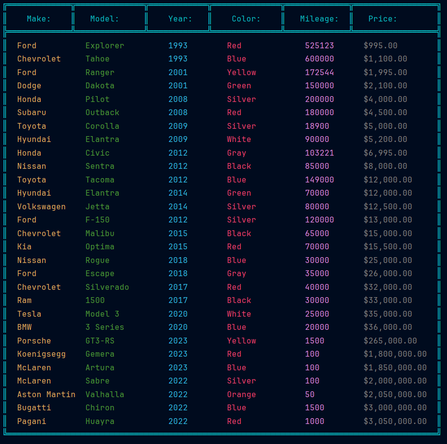
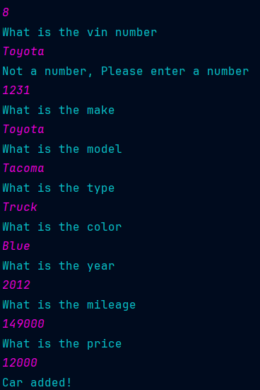

# Car Workshop

## Description

This program is to be used by dealerships to add and search by certain vehicles that the dealership would have. You are
able to search by various values like the vin, color type etc. You are able to add and remove cars by the different
values. All the vehicles and the department are saved into the inventory.csv for later use after closing the program.

## UI

You are prompted by a list of all the options that you can do with the program. You have many options that can search
and add remove vehicles. Each option with have prompts with values you would need to add to either search by or
add/remove cars.

## Actual Cars

When you search for a car it will show up with the make, model, year, color, and mileage. All of them have different
colors to have a clear distinction of each one.

## Adding/Removing Cars

When adding cars you would need to add ALL the values of the car to make sure that it gets saved correctly, and when
removing a car, all you would need is the correct vin number to search by so you would specifically get the car you 
want to remove.

# Author
## Jacob :)